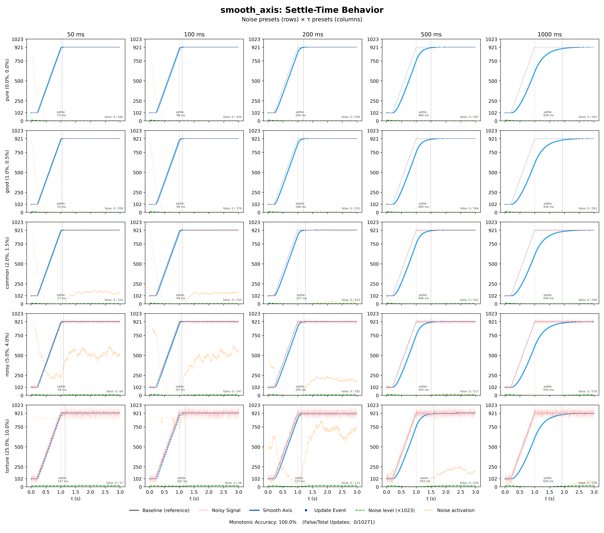

# smooth_axis

**Adaptive sensor smoothing with noise-aware change detection for embedded systems.**

A single-axis filter that lets you specify response time in seconds instead of opaque filter coefficients. Designed for potentiometers, sliders, and analog sensors on resource-constrained platforms.

---
## Why I Built This
In every project involving analog sensors or potentiometers, I ran into the same headaches: 
the input is noisy, unstable, or often refuses to hit true 0% and 100%.

You can’t build an LED dimmer that glows faintly when the slider is physically off. 
You can’t build a networked system that triggers events based on jittery input that sends false updates. 

I wrote smooth_axis to solve this once and for all. I wanted the most "boring" API possible —one that distinguishes real movement from noise
without tuning opaque math coefficients for Exponential Averages, or paying the latency and memory bill of maintaining a sliding window mean/median.

The result is a library that lets you define responsiveness in time (seconds). It filters out false reports, handles the math behind the scenes, and just works.
Plus I created a set of fine-tuning tools for handling common hardware issues.

---

## Features

- **Settle-time tuning** — specify responsiveness in seconds (50ms, 200ms, 1s)
- **Resolution agnostic** — works with any ADC resolution up to 16-bit
- **Frame-rate independent** — same behavior at 60Hz or 1000Hz
- **Noise-adaptive thresholding** — automatically distinguishes noise from real movement
- **Clear, filtered signal** — signal never reverses direction during transitions, 100% monotonic output.
- **Tiny footprint** — no heap allocation, ~88 bytes RAM per axis
- **Compatibility** - C99 standard with no dependencies. Ported to Arduino (Upcoming - QMK). [(details)](#ports)  

---

## Quick Start

```c
#include "smooth_axis.h"

uint32_t my_millis(void) { return millis(); }  // or timer_read32() for QMK

smooth_axis_config_t cfg;
smooth_axis_t axis;

smooth_axis_config_auto_dt(&cfg, 1023, 0.25f, my_millis);  // 10-bit ADC, 250ms settle
smooth_axis_init(&axis, &cfg);

void loop(void) {
    uint16_t raw = read_adc();
    smooth_axis_update_auto_dt(&axis, raw);

    if (smooth_axis_has_new_value(&axis)) {
        uint16_t value = smooth_axis_get_u16(&axis);
        // Only called when movement is real, not noise
    }
}
```

---

## The Problem

Raw ADC readings from analog sensors are noisy. The standard solution is an Exponential Moving Average (EMA):

```c
smoothed = alpha * raw + (1 - alpha) * smoothed;
```

This has three issues:

1. **Alpha is unintuitive.** What does `alpha = 0.1` feel like? Is that sluggish or responsive? You end up tuning by trial and error with no mental model to guide you.

2. **Alpha is frame-rate dependent.** The same alpha value produces different physical behavior at different loop speeds. Add a heavy function call to your loop, or run on slower hardware, and suddenly your carefully-tuned slider feels different. Alpha isn't a property of the filter — it's entangled with your program's timing.

3. **EMA doesn't solve the update problem.** A smoothed signal still fluctuates. When do you act on a change? A fixed threshold either fires on noise (too sensitive) or misses real movement (too sluggish). The right threshold depends on current noise level — which varies.

---

## How smooth_axis Solves It

### Settle-Time Semantics

Instead of alpha, you specify **settle time** — how long the filter takes to reach 95% of its target after a step change:

```c
smooth_axis_config_auto_dt(&cfg, 1023, 0.25f, timer_fn);  // 250ms settle time
```

The library computes the appropriate alpha internally based on your actual frame rate. Ask for 250ms and you get 250ms — whether your loop runs at 100Hz or 1000Hz, whether you're on an 8-bit AVR or a 32-bit ARM.

| Settle Time | Character |
|-------------|-----------|
| 50–100ms | Responsive, tracks fast movement |
| 200–300ms | Balanced feel for most applications |
| 500ms–1s | Heavily smoothed, slow/cinematic |

#### Accuracy

Measured settle time vs. requested, across a range of timing parameters:


| Condition | MAPE |
|-----------|------|
| Clean input | 1.07% |
| Noisy input (8% jitter, 4% gaussian) | 2.76% |

The conversion holds even under noise. When you ask for 500ms, you get 498–502ms.

### Noise-Adaptive Change Detection

The real work happens in deciding *when to report a change*. The library maintains a real-time noise estimate and scales the threshold dynamically:

- **Low noise** → small threshold → responsive to subtle movement
- **High noise** → large threshold → stable, no false triggers

The threshold scales between 1× and 10× of the base value, adapting as conditions change.

#### Sign-Flip Discrimination

The core insight: **noise oscillates, movement is directional.**

When input is noisy but stationary, the EMA residual (raw − smoothed) flips sign frequently as noise bounces above and below the true value. During real movement, the residual maintains consistent sign — the filter is always "catching up" in one direction.

The library uses this property:

- Frequent sign flips → noise → raise the threshold
- Consistent sign → real movement → lower the threshold

This allows aggressive noise rejection while stationary without sacrificing response speed during movement.

#### In Practice

The chart below shows the algorithm under stress: 5 noise levels × 5 settle times, from pristine (top row) to torture-test conditions (bottom row, 25% timing jitter + 10% Gaussian noise).



Watch the **dotted yellow line** (noise activation threshold) in each cell:

- During the **static segments** (before and after the ramp), sign flips are frequent. The threshold rises to suppress false updates.
- During the **ramp**, movement is directional — sign flips stop. The threshold drops rapidly, allowing the filter to track without lag.

Even in the bottom-left cell (torture noise + 50ms settle time), where the pink input signal is chaotic, the blue output rises cleanly and monotonically.

| Metric | Result |
|--------|--------|
| Monotonic accuracy | **100%** |
| False updates | **0 / 10,271** |

#### Graceful Degradation

Compare the 50ms column top-to-bottom. With clean input (top-left), the algorithm produces ~350 updates over the transition. Under torture-test noise (bottom-left), it produces only 27.

This is deliberate. When noise threatens to overwhelm the signal, the algorithm trades granularity for stability. The threshold rises until only unambiguous movement gets through. The output becomes coarser — effectively bit-crushed — but remains *correct*: monotonic, no false updates, still tracking the actual movement.

27 clean updates are more useful than 350 jittery ones.

That said, the torture row represents extreme stress conditions unlikely in practice. In real-world use — even with mediocre hardware — most applications fall somewhere in the top three rows, where degradation is negligible and the full resolution of your sensor comes through.

### Sticky Zones

Analog sensors often behave unreliably at their extremes. Sticky zones create hysteresis at the endpoints:

- Values near 0 snap to exactly 0
- Values near max snap to exactly max
- Small movements within the zone are absorbed
- Larger movements escape normally

This prevents endpoint dithering and guarantees clean 0% / 100% output when the control is at its physical limits.

---

<details>
<summary><h2>API Reference</h2></summary>

### Configuration

```c
// AUTO_DT mode: library measures your loop timing during warmup
void smooth_axis_config_auto_dt(
    smooth_axis_config_t *cfg,
    uint16_t max_raw,           // ADC max: 1023, 4095, 65535, etc.
    float settle_time_sec,      // Time to 95% settled
    smooth_axis_now_ms_fn now_ms // Monotonic millisecond timer
);

// LIVE_DT mode: you provide delta time each frame
void smooth_axis_config_live_dt(
    smooth_axis_config_t *cfg,
    uint16_t max_raw,
    float settle_time_sec
);

// Initialize axis state from config
void smooth_axis_init(smooth_axis_t *axis, const smooth_axis_config_t *cfg);

// Reset state (e.g., after sleep wake or mode change)
void smooth_axis_reset(smooth_axis_t *axis, uint16_t raw_value);
```

### Update Loop

```c
// AUTO_DT: call once per loop
void smooth_axis_update_auto_dt(smooth_axis_t *axis, uint16_t raw_value);

// LIVE_DT: call once per loop with elapsed time
void smooth_axis_update_live_dt(smooth_axis_t *axis, uint16_t raw_value, float dt_sec);
```

### Output

```c
// Check if value changed meaningfully since last check
bool smooth_axis_has_new_value(smooth_axis_t *axis);

// Get current position
float    smooth_axis_get_norm(const smooth_axis_t *axis);  // [0.0 .. 1.0]
uint16_t smooth_axis_get_u16(const smooth_axis_t *axis);   // [0 .. max_raw]
```

### Diagnostics

```c
// Current noise estimate [0.0 .. 1.0]
float smooth_axis_get_noise_norm(const smooth_axis_t *axis);

// Current effective threshold (after noise scaling)
float    smooth_axis_get_effective_thresh_norm(const smooth_axis_t *axis);
uint16_t smooth_axis_get_effective_thresh_u16(const smooth_axis_t *axis);
```

</details>

<details>
<summary><h2>Configuration Guide</h2></summary>

### Choosing a Mode

| Mode | Best For | Trade-off |
|------|----------|-----------|
| `AUTO_DT` | Stable loop rates (most QMK/Arduino) | 256-cycle warmup period |
| `LIVE_DT` | Variable timing, maximum precision | You manage delta time |

### Tuning Feel

The `smooth_axis_config_t` struct exposes additional parameters after initialization:

```c
smooth_axis_config_auto_dt(&cfg, 1023, 0.25f, timer_fn);

// Optional: adjust feel parameters (normalized 0.0 – 1.0)
cfg.full_off_norm = 0.02f;        // Clip bottom 2% to zero
cfg.full_on_norm = 0.98f;         // Clip top 2% to max
cfg.sticky_zone_norm = 0.01f;     // 1% hysteresis at endpoints
cfg.movement_thresh_norm = 0.003f; // Base threshold (before noise scaling)

smooth_axis_init(&axis, &cfg);
```

| Parameter | Default | Purpose |
|-----------|---------|---------|
| `full_off_norm` | 0.0 | Dead zone at low end (noisy/unreliable region) |
| `full_on_norm` | 1.0 | Dead zone at high end |
| `sticky_zone_norm` | ~0.3% | Endpoint hysteresis |
| `movement_thresh_norm` | ~0.3% | Base change threshold |

</details>

<details>
<summary><h2>Platform Notes</h2></summary>
<a id='ports'></a>

### QMK

```c
uint32_t qmk_timer(void) { return timer_read32(); }

smooth_axis_config_auto_dt(&cfg, 1023, 0.25f, qmk_timer);
```

### Arduino

For a cleaner Arduino-style API with a wrapper class, see the [SmoothAxis](https://github.com/Viderspace/Smooth-Axis-Arduino) library available through the Arduino Library Manager.

Direct usage:

```c
uint32_t arduino_timer(void) { return millis(); }

smooth_axis_config_auto_dt(&cfg, 1023, 0.25f, arduino_timer);
```

### Memory Usage

- `smooth_axis_t`: ~88 bytes (includes embedded config, system-dependent due to padding)
- No dynamic allocation
- Stack-safe for constrained environments

</details>

---

## License

MIT

---

## Author

Jonatan Vider
