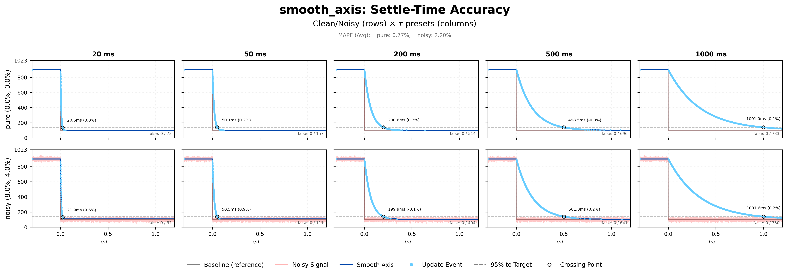
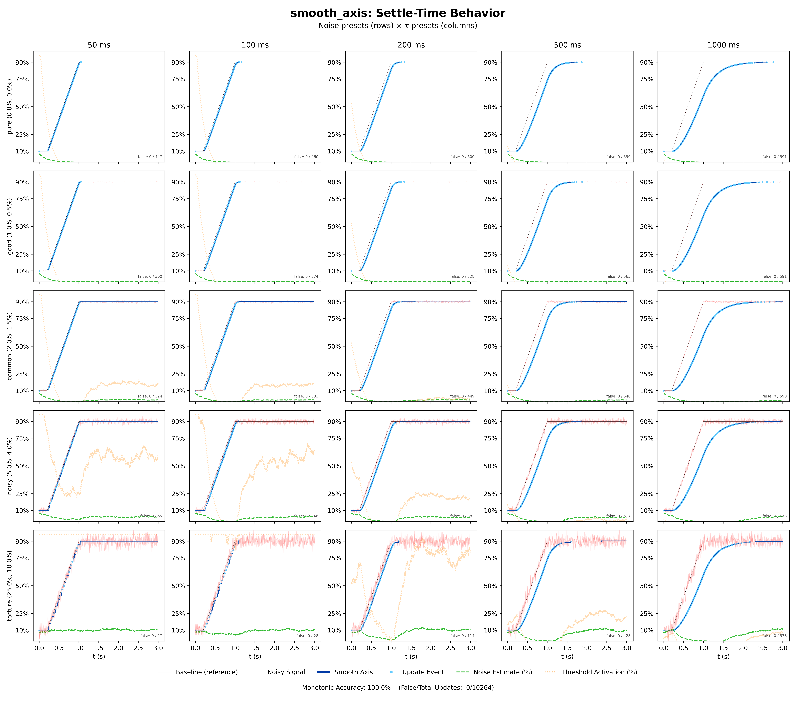

# smooth_axis


**Adaptive sensor smoothing for embedded systems.**

Specify responsiveness in seconds, not filter coefficients. Get stable output from noisy ADCs—no false updates, no jitter, no reversal during transitions.

Tested across 25 stress conditions: **100% monotonic accuracy, 0 false updates** out of 10,261 total, even under 25% timing jitter and 10% Gaussian noise.

---

## Install

**Arduino:** Available in the Library Manager → search "SmoothAxis"  
[→ Arduino wrapper repository](https://github.com/Viderspace/Smooth-Axis-Arduino)

**Other platforms:** Copy the `src` folder into your project. Include `smooth_axis.h`.

```bash
git clone https://github.com/Viderspace/smooth_axis.git
```

## Quick Start

```c
#include "smooth_axis.h"

uint32_t my_millis(void) { return millis(); }   // Your platform's ms timer

smooth_axis_config_t cfg;
smooth_axis_t axis;

smooth_axis_config_auto_dt(&cfg, 1023, 0.25f, my_millis);  // 10-bit ADC, 250ms settle
smooth_axis_init(&axis, &cfg);

void loop(void) {
    uint16_t raw = read_adc();
    smooth_axis_update_auto_dt(&axis, raw);

    if (smooth_axis_has_new_value(&axis)) {
        uint16_t value = smooth_axis_get_u16(&axis);
        // Only called when movement is real, not noise
    }
}
```

## Results

Settle-time accuracy across clean and noisy conditions:



| Condition | Mean Absolute % Error |
|-----------|----------------------|
| Clean input | 0.77% |
| Noisy input (8% jitter, 4% Gaussian) | 2.20% |

Behavior under stress (5 noise levels × 5 settle times):



Across all 25 conditions: **100% monotonic accuracy**, **0 false updates** out of 10,264 total.

## Features

- **Settle-time tuning** — specify responsiveness in seconds, not coefficients
- **Frame-rate independent** — same behavior at 60Hz or 1000Hz
- **Noise-adaptive thresholds** — distinguishes noise from movement automatically
- **Monotonic output** — signal never reverses during transitions
- **Tiny footprint** — ~80 bytes RAM, no heap allocation, C99, no dependencies

## How It Works

The library uses an EMA filter with alpha computed from your settle-time parameter and actual frame rate. Change detection uses sign-flip discrimination: noise oscillates, real movement is directional. The threshold scales dynamically—tight when stable, loose when noise spikes.

For the full algorithm explanation, see [docs/ALGORITHM.md](docs/ALGORITHM.md).


<details>
<summary><h2>API Reference</h2></summary>

### Configuration

```c
// AUTO_DT mode: library measures your loop timing during warmup
void smooth_axis_config_auto_dt(
    smooth_axis_config_t *cfg,
    uint16_t max_raw,           // ADC max: 1023, 4095, 65535, etc.
    float settle_time_sec,      // Time to 95% settled
    smooth_axis_now_ms_fn now_ms // Monotonic millisecond timer
);

// LIVE_DT mode: you provide delta time each frame
void smooth_axis_config_live_dt(
    smooth_axis_config_t *cfg,
    uint16_t max_raw,
    float settle_time_sec
);

// Initialize axis state from config
void smooth_axis_init(smooth_axis_t *axis, const smooth_axis_config_t *cfg);

// Reset state (e.g., after sleep wake or mode change)
void smooth_axis_reset(smooth_axis_t *axis, uint16_t raw_value);
```

### Update Loop

```c
// AUTO_DT: call once per loop
void smooth_axis_update_auto_dt(smooth_axis_t *axis, uint16_t raw_value);

// LIVE_DT: call once per loop with elapsed time
void smooth_axis_update_live_dt(smooth_axis_t *axis, uint16_t raw_value, float dt_sec);
```

### Output

```c
// Check if value changed meaningfully since last check
bool smooth_axis_has_new_value(smooth_axis_t *axis);

// Get current position
float    smooth_axis_get_norm(const smooth_axis_t *axis);  // [0.0 .. 1.0]
uint16_t smooth_axis_get_u16(const smooth_axis_t *axis);   // [0 .. max_raw]
```

### Diagnostics

```c
// Current noise estimate [0.0 .. 1.0]
float smooth_axis_get_noise_norm(const smooth_axis_t *axis);

// Current effective threshold (after noise scaling)
float    smooth_axis_get_effective_thresh_norm(const smooth_axis_t *axis);
uint16_t smooth_axis_get_effective_thresh_u16(const smooth_axis_t *axis);
```

</details>

<details>
<summary><h2>Configuration Guide</h2></summary>

### Choosing a Mode

| Mode | Best For | Trade-off |
|------|----------|-----------|
| `AUTO_DT` | Stable loop rates (most QMK/Arduino) | 256-cycle warmup period |
| `LIVE_DT` | Variable timing, maximum precision | You manage delta time |

### Selecting responsiveness

| Settle Time - Choose your preference | Behaviour                           |
|--------------------------------------|-------------------------------------|
| 50–100ms                             | Responsive, tracks fast movement    |
| 200–300ms                            | Balanced feel for most applications |
| 500ms–1s                             | Heavily smoothed, slow/cinematic    |

### Tuning Feel

The `smooth_axis_config_t` struct exposes additional parameters after initialization:

```c
smooth_axis_config_auto_dt(&cfg, 1023, 0.25f, timer_fn);

// Optional: adjust feel parameters (normalized 0.0 – 1.0)
cfg.full_off_norm = 0.02f;        // Clip bottom 2% to zero
cfg.full_on_norm = 0.98f;         // Clip top 2% to max
cfg.sticky_zone_norm = 0.01f;     // 1% hysteresis at endpoints

smooth_axis_init(&axis, &cfg);
```

### Sticky Zones

Analog sensors often behave unreliably at their extremes. Sticky zones create hysteresis at the endpoints:

- Values near 0 snap to exactly 0
- Values near max snap to exactly max
- Small movements within the zone are absorbed
- Larger movements escape normally

This prevents endpoint dithering and guarantees clean 0% / 100% output when the control is at its physical limits.

| Parameter | Default | Purpose |
|-----------|---------|---------|
| `full_off_norm` | 0.0 | Dead zone at low end (noisy/unreliable region) |
| `full_on_norm` | 1.0 | Dead zone at high end |
| `sticky_zone_norm` | ~0.3% | Endpoint hysteresis |

</details>

## License

MIT

## Author

[Jonatan Vider](https://github.com/Viderspace) - [LinkedIn](http://www.linkedin.com/in/viderspace)
