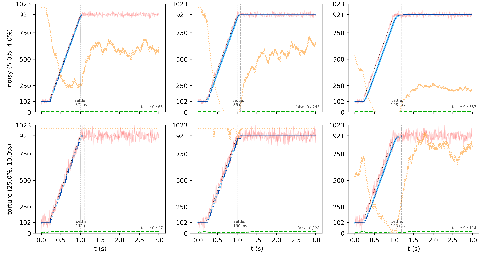

# Algorithm Deep-Dive

## The EMA Problem

Raw ADC readings from analog sensors are noisy. The standard solution is an Exponential Moving Average (EMA):

```c
smoothed = alpha * raw + (1 - alpha) * smoothed;
```

This has three issues:

1. **Alpha is unintuitive.** Does `alpha = 0.1` respond quickly enough? stable enough?


2. **Alpha is frame-rate dependent.** Add a heavy function call or switch hardware, suddenly your carefully-tuned slider feels different.


3. **EMA doesn't solve the update problem.** Even a smoothed signal still fluctuates. If you care about false update overhead, you'll need additional filtering anyway.

## Solution 1: Time-based smoothing (dt-aware EMA)

Instead of choosing an arbitrary EMA factor (like alpha = 0.1), the library lets you define how fast the axis should settle in real time - e.g., “reach 95% of a new value in ~250 ms”.

```c
smooth_axis_config_auto_dt(&cfg, 1023, 0.25f, timer_fn);  // 250ms settle time
```

### The Math

> **settle_time (def)**: duration in seconds to reach 95% of a new target after a step change

The library computes the appropriate alpha internally based on your actual frame rate (delta-time), given the constant settle_time you selected:

```
α(dt) := 1 − exp(k · dt),  where k := ln(0.05) / settle_time
```

### Frame-rate independence

This makes the smoothing behave the same whether your loop runs at 50 Hz, 20 kHz, or jumps around due to OS scheduling.

Faster frames → smaller steps, slower frames → bigger steps — but the overall feel stays identical.

This is computed once during initialization warm-up based on measured frame rate (AUTO_DT mode) or provided each frame (LIVE_DT mode).

### Accuracy validation

Measured settle time vs. requested across clean and noisy conditions:


| Condition | MAPE               |
|--------|----------|
| Clean input           | 0.77%    |
| Noisy input               | 2.20% |

## Solution 2: Adaptive Thresholding

Smoothing alone doesn't solve the problem. A smoothed signal still fluctuates, and any system that acts on changes needs to know which changes are real.

**The naive solution is a fixed threshold:**\
If the smoothed signal differs from the last reported value by more than some constant, report it as movement. Set the threshold above the noise floor and false updates disappear.

### Why fixed thresholds fail

For two reasons:

1. __Sensitivity loss__: \
   A threshold large enough to reject noise also masks real movement. With potentiometers, you feel it as dead spots. With sensors, you lose resolution.


2. __Non-uniform noise__: \
   Analog hardware is often noisier in some ranges than others. A single threshold is too high in quiet regions (killing sensitivity) and too low in noisy regions (leaking false updates).

**smooth_axis solves this with adaptive thresholding.**\
The threshold scales with a real-time noise estimate, drops when sign-flip analysis detects true movement, and is proportional to settle time (longer settle times produce steadier signals that need less threshold protection).

The library maintains a real-time noise estimate and scales the threshold dynamically:

- Low noise → small threshold → responsive to subtle movement
- High noise → large threshold → stable, no false triggers

### Noise estimation via Jacobson/Karels

The noise estimator is based on the Jacobson/Karels algorithm (1988), which solved an analogous problem in TCP congestion control. TCP needs to decide when a packet is "actually lost" versus "just delayed." Too sensitive, and you retransmit unnecessarily. Too sluggish, and you wait forever for packets that will never arrive. Jacobson's insight was to track not just the smoothed round-trip time, but also its variance—then set the timeout as a function of both. smooth_axis applies the same structure to a different signal:

| TCP (Jacobson/Karels) | smooth_axis                           |
|--------------------------------------|-------------------------------------|
| Smoothed RTT                         | Smoothed sensor value    |
| RTT variance                         | Signal deviation estimate |
| Retransmission timeout               | Movement detection threshold    |

### Sign-Flip discrimination

Estimating noise accurately solves the 'how high should the threshold be' question,\
but in order to keep the responsiveness feel, we need to know when to lower it and allow responsive movement.

**A core insight: noise oscillates, movement is directional.**

When input is noisy but stationary, the EMA residual (raw − smoothed) flips sign frequently as noise bounces above and below the true value. During real movement, the residual maintains consistent sign — the filter is always "catching up" in one direction.

The library uses this property:

* Frequent sign flips → noise → raise the threshold
* Consistent sign → real movement → lower the threshold

## Behavior Under Stress

Raising the threshold as high as the noise floor, while responding quick enough to true movement, allows aggressive noise rejection when stationary, without sacrificing response speed on movement.

During the static phases (before 0.3s and after 1.0s)., sign flips are frequent and the threshold (orange) is elevated. When movement begins, the residual maintains consistent sign—the threshold drops immediately, allowing updates through without lag.



### Graceful Degradation

Compare the top row (with less noise) to the lower row (more noise), the algorithm produces fewer update events over the transition. Under torture-test noise (bottom row), it produces only 27 steps.

This is deliberate. When noise threatens to overwhelm the signal, the algorithm trades granularity for stability. The threshold rises until only unambiguous movement gets through. The output becomes coarser - effectively bit-crushed - but remains correct: monotonic, no false updates, still tracking the actual movement.


---

## Reproducibility

All test results shown in this document are fully reproducible. The complete test harness, data generation, and visualization pipeline are included in this repository.

To reproduce these results:

```bash
# From project root
make prepare-tests
make run-tests
```

See [tests/README.md](../tests/README.md) for detailed instructions.
